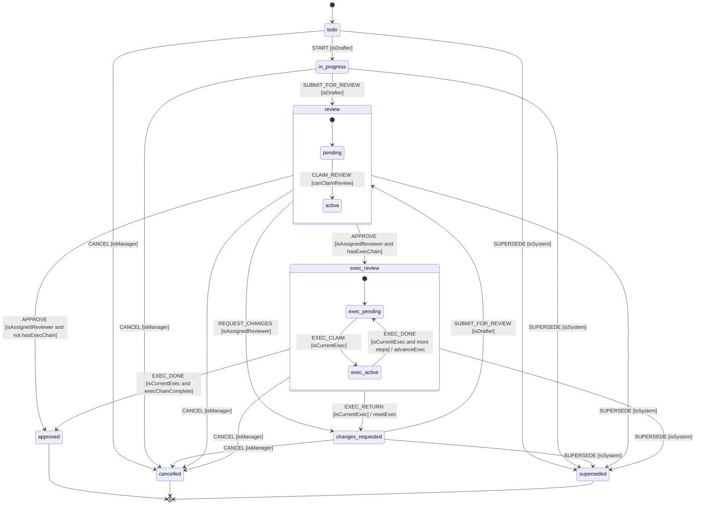

# Workflow engine for fiscal note review and approval

Date: 2026-09-02. Library versions, dates, and star counts were checked against npm, PyPI, and the GitHub API on that date.

## 1. Summary and recommendation

The review-and-approval workflow is a finite state machine with fewer than a dozen states, driven by human actions (submit, review, approve, mark done) and two external triggers (new bill version, hearing scheduled). Every transition is a single database write. The load is 300-500 notes per session. Nothing in the workflow needs durable long-running code, retries, or fan-out. A workflow server (Temporal, Camunda, Conductor, Flowable, Windmill, Trigger.dev, Inngest) adds at least one additional process plus Redis or Elasticsearch, a worker deployment model, and a second source of truth for state that the dashboards would have to mirror into Postgres anyway.

**Recommendation: an in-process, declarative state machine library, with all state, history, assignments, and deadlines in application-owned Postgres tables, and deadline escalation run by a database-scheduled job.**

- **Primary library: XState v5** (`xstate` 5.32.6, MIT, released 2026-08-25). Favors a TypeScript backend (NestJS or Next.js route handlers). The machine is defined once with `setup().createMachine()`, evaluated on the server with the pure `transition(machine, snapshot, event)` function (returns the next snapshot and the list of actions for the application to execute), persisted as a JSON snapshot column, and the same definition is imported by the React frontend to compute which buttons to show. Guards take `{ context, event }` plus typed params, which covers role checks.
- **If the backend is Python: python-statemachine 3.2.1** (MIT, released 2026-08-01). Same design; the machine binds to a model object through `state_field`, guards are `cond`/`unless`/`validators` with keyword-argument injection, and `after_transition` hooks write the audit row. The frontend then uses a static JSON export of the transition table instead of a shared module.
- **Fallback: a hand-rolled table-driven machine** in either stack. The transition table below has 8 states and 13 events. A dictionary keyed by `(state, event)` with a guard function and an action list per entry is about 250-400 lines including tests. It gives up `can(event)` introspection, hierarchical states, diagram export, and typed event contracts, all of which the two libraries provide for free.
- **Not recommended for the POC:** any engine that needs its own server. Temporal is the strongest of those (MIT, Postgres persistence, durable timers, Python and TypeScript SDKs) and is the one to revisit if the tool later needs durable multi-step automation such as bill-text ingestion pipelines. Camunda 8 requires a paid license for self-managed production. Windmill, Inngest, and Restate carry AGPL, SSPL/GPL, and BSL terms respectively.

Timers: neither XState delayed transitions (`after`) nor python-statemachine have durable timers; both run in-process and are lost on restart. Deadlines are stored as rows and fired by a job (pg-boss 12.29.0 for Node, procrastinate 3.9.0 for Python, or a plain `SELECT ... FOR UPDATE SKIP LOCKED` poller). Section 5 covers this.

## 2. Comparison table

Fit score: 5 = adopt as-is for this POC; 1 = excluded on license, stack, or maintenance grounds.

| Candidate | Language | License | Latest release (date) | Stars | Own server? | Persistence | Guards / roles | Timers | History / audit | Fit |
|---|---|---|---|---|---|---|---|---|---|---|
| XState v5 | TS/JS | MIT | 5.32.6 (2026-08-25); 6.0 alphas in progress | 30.1k | No | App stores `getPersistedSnapshot()` JSON; pure `transition()` for request/response use | `setup({ guards })`, params, `{context, event}` | `after` delays via in-process clock; not durable | None built-in; app records from returned actions | 5 (TS) |
| @xstate/store | TS/JS | MIT | 4.2.3 | (same repo) | No | Plain store | No guards, no hierarchy | No | No | 2 |
| python-statemachine | Python >=3.10 | MIT | 3.2.1 (2026-08-01) | 1.3k | No | Binds to model `state_field`; app persists the model | `cond`, `unless`, `validators` with kwargs injection | None | Generic hooks (`after_transition`) | 5 (Py) |
| transitions (pytransitions) | Python | MIT | 0.9.3 (2025-07-02); last push 2025-09-11 | 6.6k | No | Model attribute | `conditions`/`unless` | `Timeout` extension, in-process | Callbacks only | 3 |
| django-viewflow 2 / viewflow.fsm | Python (Django) | AGPL-3.0-or-later | 2.4.0 (2026-07-30) | 2.9k | No (Django app) | Django models | `@transition(..., permission=)` | Via Celery | Built-in process log (workflow part) | 2 (AGPL; Django only) |
| django-fsm-2 | Python (Django) | MIT | 4.2.4 (2026-03-16) | 279 | No (Django app) | `FSMField` | `conditions`, `permission` | None | `django-fsm-log` companion | 2 (Django only; original django-fsm archived) |
| SpiffWorkflow | Python >=3.10 | LGPL-3.0 | 3.2.0 (2026-08-10) | 1.9k | No | App serializes workflow JSON | BPMN gateways, script tasks | BPMN timer events; app must drive the clock | Task tree | 2 (BPMN overhead; LGPL flagged) |
| Temporal | Go server; Python SDK 1.32.0 (2026-08-24), TS SDK 1.23.0 (2026-08-26) | MIT | Server v1.31.2 (2026-07-08) | 22.8k | Yes: frontend/history/matching/worker + Postgres, optional Elasticsearch; `temporal server start-dev` for local | Engine-owned event history | Code in workflow; signals for human actions | Durable timers | Complete event history | 3 |
| Camunda 8 / Zeebe | Java; REST clients | Camunda License 1.0; self-managed production requires paid Enterprise edition | 8.9.18 (2026-08-31) | 4.3k | Yes | Engine-owned | BPMN, Identity | BPMN timers | Operate | 1 |
| Conductor (conductor-oss) | Java server; Python/TS SDKs | Apache-2.0 | v3.32.1 (2026-08-12) | 32.2k | Yes: Java server + Redis/Postgres, optional Elasticsearch | Engine-owned | In task workers | WAIT tasks | Execution log | 2 |
| Windmill | Rust/TS | AGPL-3.0 plus proprietary Community Edition code | v1.802.0 (2026-09-02) | 17.8k | Yes | Engine-owned | Scripts | Yes | Run log | 1 |
| Elsa Workflows | .NET | MIT | 3.8.0-rc2 (2026-08-21) | 7.9k | Yes (.NET host) | EF Core | Activities | Yes | Yes | 1 (stack) |
| Flowable | Java/Spring | Apache-2.0 | 8.0.0 (2026-02-27) | 9.5k | Yes | Engine-owned (JDBC) | BPMN, identity links | BPMN timers | History tables | 1 (stack) |
| Inngest | Go server; JS SDK | Server SSPL-1.0 (Apache-2.0 grant after 3 years); `inngest-js` GPL-3.0 | v1.44.0 (2026-08-26) | 5.8k | Yes | Engine-owned | Code | `step.sleepUntil` | Run log | 1 (license) |
| Trigger.dev | TS | Apache-2.0 | v4.5.16 (2026-09-02) | 16.2k | Yes: webapp + supervisor, Postgres, Redis, ClickHouse, Docker registry, MinIO; docs state 3+ vCPU/6 GB and 4+ vCPU/8 GB machines | Engine-owned | Code | `wait.until` | Run log | 2 |
| Restate | Rust server; TS/Python SDKs | BSL 1.1 | active | 4.4k | Yes | Engine-owned | Code | Durable | Journal | 1 (license) |
| DBOS Transact | Python 2.31.0 / TS 4.27.6 | MIT | active (pushed 2026-09-02) | 1.6k / 1.3k | No (Postgres only) | Postgres system tables | Code | Durable sleep, scheduled workflows | Workflow log | 3 (option for timers if a poller proves insufficient) |
| workflow-es | TS/JS | MIT | 2.3.5; last push 2025-01-18 | 218 | No | Pluggable (Mongo, Postgres via Sequelize) | Code | Yes | Yes | 1 (dormant) |
| javascript-state-machine | JS | MIT | 3.1.0 (2018); last push 2025-06 | 8.7k | No | App | Callbacks | No | History plugin | 2 (unmaintained) |
| typescript-fsm | TS | Apache-2.0 | 1.6.0; last push 2025-11 | 300 | No | App | Callbacks | No | No | 2 |
| Prisma/Sequelize FSM helpers | TS | - | none found that is maintained | - | - | - | - | - | - | n/a |
| stateless | .NET | Apache-2.0 | last push 2026-04-04 | 6.3k | No | App | Guards | No | No | 1 (stack) |
| Hand-rolled table-driven machine | either | n/a | n/a | n/a | No | App tables | Guard fn per row | None (use scheduler) | App writes | 4 |

Supporting libraries for the scheduler:

| Library | Language | License | Latest | Stars | Role |
|---|---|---|---|---|---|
| pg-boss | Node | MIT | 12.29.0 (2026-08-30) | 3.9k | Postgres-backed delayed jobs |
| procrastinate | Python | MIT | 3.9.0 (2026-06-20) | 1.4k | Postgres-backed delayed jobs |

## 3. Workflow definition

One machine instance per **note revision**. A note revision is the unit tied to one bill version or amendment. When the bill module reports a new version, the workflow module creates a new revision instance and sends `SUPERSEDE` to the old one if it is not yet approved. An approved revision stays `approved` and is linked by `superseded_by`; end users continue to see it until the new revision is approved.

### States

| Machine state | Drafter sees | Reviewer sees | End user sees | Editing allowed |
|---|---|---|---|---|
| `todo` | to-do | - | no | drafter |
| `in_progress` | in-progress | - | no | drafter |
| `review.pending` | ready-for-review | pending | no | no |
| `review.active` | ready-for-review | in-review | no | reviewer (edits tracked as review) |
| `changes_requested` | address-review | changes-requested | no | drafter |
| `exec_review.pending` | in executive review | current exec: pending; earlier execs: approved | no | no |
| `exec_review.active` | in executive review | current exec: in-review | no | current exec |
| `approved` | approved | approved | yes | no |
| `cancelled` | cancelled | cancelled | no | no |
| `superseded` | superseded | superseded | no | no |

`review` and `exec_review` are compound states with `pending`/`active` children. The dashboards flatten them with the mapping above. `approved`, `cancelled`, and `superseded` are final.

### Events and guards

| Event | From | To | Guard | Actions |
|---|---|---|---|---|
| `ASSIGN_DRAFTER {userId, dueAt?}` | `todo`, `in_progress`, `changes_requested` | same | `isManager` or `isEditor` | `setDrafter`, `notify(drafter)`, `emit(note.assigned)` |
| `START` | `todo` | `in_progress` | `isDrafter` | - |
| `SUBMIT_FOR_REVIEW {comment?}` | `in_progress`, `changes_requested` | `review.pending` | `isDrafter` | `notify(reviewer or editor pool)` |
| `CLAIM_REVIEW` | `review.pending` | `review.active` | `isAssignedReviewer` or (`isEditor` and no reviewer set) | `setReviewer`, `emit(note.assigned)` |
| `REQUEST_CHANGES {comment}` | `review.active` | `changes_requested` | `isAssignedReviewer` | `notify(drafter)` |
| `APPROVE {comment?}` | `review.active` | `exec_review.pending` if `hasExecChain`, else `approved` | `isAssignedReviewer` | `notify(nextExec)` or `emit(note.approved)` |
| `SET_EXEC_CHAIN {chain}` | any non-final state before `exec_review` | same | `isManager` | `setExecChain` |
| `EXEC_CLAIM` | `exec_review.pending` | `exec_review.active` | `isCurrentExec` | - |
| `EXEC_DONE {comment?}` | `exec_review.active` | `exec_review.pending` if more steps, else `approved` | `isCurrentExec` | `markExecStepDone`, `advanceExec`, `notify(nextExec)` or `emit(note.approved)` |
| `EXEC_RETURN {comment}` | `exec_review.active` | `changes_requested` | `isCurrentExec` | `resetExecIndex`, `notify(drafter)` |
| `REASSIGN {role, userId, position?}` | any non-final | same | `isManager` | `reassign`, `notify(new assignee)`, `emit(note.assigned)` |
| `CANCEL {comment}` | any non-final | `cancelled` | `isManager` | `notify(drafter, reviewer)` |
| `SUPERSEDE {newBillVersionId}` | any non-final | `superseded` | `isSystem` | `notify(drafter)`, `emit(note.superseded)` |

Every transition also runs `audit` (writes a `workflow_transition` row) and `emit(note.transitioned)`. These are wired once at the machine root, not per transition.

"Duplicate task" from the RFP is not a transition: it is `POST /notes/{id}/workflow/duplicate`, which creates a new revision instance in `todo` with the same assignments and a `duplicated_from` link.

### Executive Review chain

The chain is per-instance data, not machine structure. `context.execChain` is an ordered list of `{ userId, division, dueAt, doneAt }`; `context.execIndex` points at the current reviewer. `EXEC_DONE` stamps `doneAt`, increments the index, and either re-enters `exec_review.pending` (notifying the next reviewer) or goes to `approved`. `REASSIGN { role: 'exec', position }` replaces one step. `EXEC_RETURN` sends the note back to the drafter and resets the index to 0; on resubmission and editor approval the chain restarts from the first reviewer. Parallel executive review is out of scope for the POC (Section 7).

### XState v5 definition

```ts
// workflow/fiscal-note.machine.ts
import { setup, assign, and } from 'xstate';

export type Role = 'drafter' | 'editor' | 'executive' | 'manager' | 'system';
export interface Actor { userId: string; roles: Role[] }
export interface ExecStep { userId: string; division: string; dueAt: string | null; doneAt: string | null }

export interface Ctx {
  noteRevisionId: string;
  billVersionId: string;
  drafterId: string | null;
  reviewerId: string | null;
  execChain: ExecStep[];
  execIndex: number;
}

type WithActor<T> = T & { actor: Actor };
export type Ev =
  | WithActor<{ type: 'ASSIGN_DRAFTER'; userId: string; dueAt?: string }>
  | WithActor<{ type: 'START' }>
  | WithActor<{ type: 'SUBMIT_FOR_REVIEW'; comment?: string }>
  | WithActor<{ type: 'CLAIM_REVIEW' }>
  | WithActor<{ type: 'REQUEST_CHANGES'; comment: string }>
  | WithActor<{ type: 'APPROVE'; comment?: string }>
  | WithActor<{ type: 'SET_EXEC_CHAIN'; chain: ExecStep[] }>
  | WithActor<{ type: 'EXEC_CLAIM' }>
  | WithActor<{ type: 'EXEC_DONE'; comment?: string }>
  | WithActor<{ type: 'EXEC_RETURN'; comment: string }>
  | WithActor<{ type: 'REASSIGN'; role: 'drafter' | 'reviewer' | 'exec'; userId: string; position?: number }>
  | WithActor<{ type: 'CANCEL'; comment: string }>
  | WithActor<{ type: 'SUPERSEDE'; newBillVersionId: string }>;

const has = (e: { actor: Actor }, r: Role) => e.actor.roles.includes(r);

export const fiscalNoteMachine = setup({
  types: {
    context: {} as Ctx,
    events: {} as Ev,
    input: {} as Pick<Ctx, 'noteRevisionId' | 'billVersionId'> & Partial<Ctx>,
  },
  guards: {
    isDrafter: ({ context, event }) => event.actor.userId === context.drafterId,
    isEditor: ({ event }) => has(event, 'editor'),
    isManager: ({ event }) => has(event, 'manager'),
    isSystem: ({ event }) => has(event, 'system'),
    isAssignedReviewer: ({ context, event }) => event.actor.userId === context.reviewerId,
    canClaimReview: ({ context, event }) =>
      event.actor.userId === context.reviewerId || (context.reviewerId === null && has(event, 'editor')),
    isCurrentExec: ({ context, event }) =>
      context.execChain[context.execIndex]?.userId === event.actor.userId,
    hasExecChain: ({ context }) => context.execChain.length > 0,
    execChainComplete: ({ context }) => context.execIndex + 1 >= context.execChain.length,
  },
  actions: {
    // Context updates are applied inside transition(); the app sees them in the next snapshot.
    setDrafter: assign({
      drafterId: ({ event }) => (event.type === 'ASSIGN_DRAFTER' ? event.userId : null),
    }),
    setReviewer: assign({
      reviewerId: ({ context, event }) => context.reviewerId ?? event.actor.userId,
    }),
    setExecChain: assign({
      execChain: ({ event, context }) => (event.type === 'SET_EXEC_CHAIN' ? event.chain : context.execChain),
      execIndex: 0,
    }),
    markExecStepDone: assign({
      execChain: ({ context }) =>
        context.execChain.map((s, i) => (i === context.execIndex ? { ...s, doneAt: new Date().toISOString() } : s)),
    }),
    advanceExec: assign({ execIndex: ({ context }) => context.execIndex + 1 }),
    resetExec: assign({
      execIndex: 0,
      execChain: ({ context }) => context.execChain.map((s) => ({ ...s, doneAt: null })),
    }),
    reassign: assign(({ context, event }) => {
      if (event.type !== 'REASSIGN') return {};
      if (event.role === 'drafter') return { drafterId: event.userId };
      if (event.role === 'reviewer') return { reviewerId: event.userId };
      const chain = context.execChain.map((s, i) => (i === event.position ? { ...s, userId: event.userId } : s));
      return { execChain: chain };
    }),
    // Side effects are declared here and executed by the application (see Section 4).
    notify: (_, _params: { to: 'drafter' | 'reviewer' | 'editors' | 'currentExec' | 'manager' }) => {},
    emit: (_, _params: { type: 'note.assigned' | 'note.approved' | 'note.superseded' }) => {},
  },
}).createMachine({
  id: 'fiscalNote',
  context: ({ input }) => ({
    noteRevisionId: input.noteRevisionId,
    billVersionId: input.billVersionId,
    drafterId: input.drafterId ?? null,
    reviewerId: input.reviewerId ?? null,
    execChain: input.execChain ?? [],
    execIndex: 0,
  }),
  initial: 'todo',
  on: {
    REASSIGN: { guard: 'isManager', actions: ['reassign', { type: 'emit', params: { type: 'note.assigned' } }] },
    CANCEL: { guard: 'isManager', target: '.cancelled' },
    SUPERSEDE: { guard: 'isSystem', target: '.superseded',
      actions: [{ type: 'emit', params: { type: 'note.superseded' } }] },
    SET_EXEC_CHAIN: { guard: 'isManager', actions: 'setExecChain' },
  },
  states: {
    todo: {
      on: {
        ASSIGN_DRAFTER: { guard: 'isManager', actions: ['setDrafter',
          { type: 'notify', params: { to: 'drafter' } }, { type: 'emit', params: { type: 'note.assigned' } }] },
        START: { guard: 'isDrafter', target: 'in_progress' },
      },
    },
    in_progress: {
      on: {
        ASSIGN_DRAFTER: { guard: 'isManager', actions: ['setDrafter',
          { type: 'notify', params: { to: 'drafter' } }, { type: 'emit', params: { type: 'note.assigned' } }] },
        SUBMIT_FOR_REVIEW: { guard: 'isDrafter', target: 'review' },
      },
    },
    review: {
      initial: 'pending',
      entry: { type: 'notify', params: { to: 'editors' } },
      states: {
        pending: { on: { CLAIM_REVIEW: { guard: 'canClaimReview', target: 'active', actions: 'setReviewer' } } },
        active: {
          on: {
            REQUEST_CHANGES: { guard: 'isAssignedReviewer', target: '#fiscalNote.changes_requested' },
            // Guarded transitions are tried in array order; the first passing guard wins.
            APPROVE: [
              { guard: and(['isAssignedReviewer', 'hasExecChain']), target: '#fiscalNote.exec_review' },
              { guard: 'isAssignedReviewer', target: '#fiscalNote.approved' },
            ],
          },
        },
      },
    },
    changes_requested: {
      entry: { type: 'notify', params: { to: 'drafter' } },
      on: {
        ASSIGN_DRAFTER: { guard: 'isManager', actions: ['setDrafter', { type: 'notify', params: { to: 'drafter' } }] },
        SUBMIT_FOR_REVIEW: { guard: 'isDrafter', target: 'review' },
      },
    },
    exec_review: {
      initial: 'pending',
      states: {
        pending: {
          entry: { type: 'notify', params: { to: 'currentExec' } },
          on: { EXEC_CLAIM: { guard: 'isCurrentExec', target: 'active' } },
        },
        active: {
          on: {
            EXEC_DONE: [
              { guard: and(['isCurrentExec', 'execChainComplete']), target: '#fiscalNote.approved',
                actions: 'markExecStepDone' },
              { guard: 'isCurrentExec', target: 'pending', actions: ['markExecStepDone', 'advanceExec'] },
            ],
            EXEC_RETURN: { guard: 'isCurrentExec', target: '#fiscalNote.changes_requested', actions: 'resetExec' },
          },
        },
      },
    },
    approved: { type: 'final', entry: { type: 'emit', params: { type: 'note.approved' } } },
    cancelled: { type: 'final' },
    superseded: { type: 'final' },
  },
});
```

`and` is the higher-order guard exported by `xstate`. The `notify` and `emit` actions have empty bodies on purpose: with the pure `transition()` function they are returned to the caller as `{ type, params }` objects and executed by the transition service (Section 4).

### python-statemachine 3.x equivalent (abridged)

```python
from statemachine import StateChart, State

class FiscalNoteFlow(StateChart["NoteRevision"]):
    todo = State(initial=True)
    in_progress = State()
    review_pending = State()
    review_active = State()
    changes_requested = State()
    exec_pending = State()
    exec_active = State()
    approved = State(final=True)
    cancelled = State(final=True)
    superseded = State(final=True)

    start = todo.to(in_progress, cond="is_drafter")
    submit_for_review = (in_progress | changes_requested).to(review_pending, cond="is_drafter")
    claim_review = review_pending.to(review_active, cond="can_claim_review", on="set_reviewer")
    request_changes = review_active.to(changes_requested, cond="is_assigned_reviewer")
    approve = review_active.to(exec_pending, cond=["is_assigned_reviewer", "has_exec_chain"]) | \
              review_active.to(approved, cond="is_assigned_reviewer")
    exec_claim = exec_pending.to(exec_active, cond="is_current_exec")
    exec_done = exec_active.to(approved, cond=["is_current_exec", "exec_chain_complete"], on="mark_step_done") | \
                exec_active.to(exec_pending, cond="is_current_exec", on=["mark_step_done", "advance_exec"])
    exec_return = exec_active.to(changes_requested, cond="is_current_exec", on="reset_exec")
    cancel = (todo | in_progress | review_pending | review_active | changes_requested
              | exec_pending | exec_active).to(cancelled, cond="is_manager")
    supersede = (todo | in_progress | review_pending | review_active | changes_requested
                 | exec_pending | exec_active).to(superseded, cond="is_system")

    def is_drafter(self, actor): return actor.user_id == self.model.drafter_id
    def is_manager(self, actor): return "manager" in actor.roles
    def is_system(self, actor): return "system" in actor.roles
    def is_assigned_reviewer(self, actor): return actor.user_id == self.model.reviewer_id
    def can_claim_review(self, actor):
        return actor.user_id == self.model.reviewer_id or (self.model.reviewer_id is None and "editor" in actor.roles)
    def has_exec_chain(self): return len(self.model.exec_chain) > 0
    def is_current_exec(self, actor):
        chain, i = self.model.exec_chain, self.model.exec_index
        return i < len(chain) and chain[i]["user_id"] == actor.user_id
    def exec_chain_complete(self): return self.model.exec_index + 1 >= len(self.model.exec_chain)

    def after_transition(self, event, source, target, actor, comment=None, **kw):
        self.model.pending_effects.append(("audit", event, source.id, target.id, actor.user_id, comment))
        self.model.pending_effects.append(("emit", "note.transitioned"))
```

The machine is instantiated per request with `FiscalNoteFlow(model=note_revision, state_field="state")` and driven with `sm.send("approve", actor=actor, comment=...)`. Side effects are collected in `pending_effects` and executed by the service after the database commit, matching the XState executor pattern in Section 4. The compound `review`/`exec_review` states are flattened here for brevity; python-statemachine 3.x also supports compound states.

### Mermaid diagram



`ASSIGN_DRAFTER`, `REASSIGN`, and `SET_EXEC_CHAIN` are self-transitions and are omitted from the diagram.

## 4. Persistence design

All tables live in the application database under a `workflow` schema. The workflow module owns them; other modules read through the API in Section 6.

```sql
CREATE TABLE workflow.instance (
  id                uuid PRIMARY KEY,
  note_revision_id  uuid NOT NULL UNIQUE,      -- opaque to this module
  bill_version_id   text NOT NULL,             -- opaque to this module
  machine_name      text NOT NULL DEFAULT 'fiscalNote',
  machine_version   int  NOT NULL DEFAULT 1,   -- bump when the machine definition changes
  state             text NOT NULL,             -- flattened, e.g. 'review.pending'
  snapshot          jsonb NOT NULL,            -- XState persisted snapshot (context + state value)
  drafter_id        text,
  reviewer_id       text,
  exec_index        int  NOT NULL DEFAULT 0,
  version           int  NOT NULL DEFAULT 0,   -- optimistic concurrency
  superseded_by     uuid REFERENCES workflow.instance(id),
  duplicated_from   uuid REFERENCES workflow.instance(id),
  created_at        timestamptz NOT NULL DEFAULT now(),
  updated_at        timestamptz NOT NULL DEFAULT now()
);
CREATE INDEX ON workflow.instance (state);
CREATE INDEX ON workflow.instance (drafter_id, state);
CREATE INDEX ON workflow.instance (reviewer_id, state);

CREATE TABLE workflow.transition (            -- audit log, append-only
  id            bigserial PRIMARY KEY,
  instance_id   uuid NOT NULL REFERENCES workflow.instance(id),
  seq           int  NOT NULL,                -- = instance.version after the write
  event         text NOT NULL,
  from_state    text NOT NULL,
  to_state      text NOT NULL,
  actor_id      text NOT NULL,                -- 'system' for automated events
  actor_roles   text[] NOT NULL,
  comment       text,
  payload       jsonb,                        -- event fields other than actor/comment
  occurred_at   timestamptz NOT NULL DEFAULT now(),
  UNIQUE (instance_id, seq)
);

CREATE TYPE workflow.role AS ENUM ('drafter', 'reviewer', 'exec_reviewer');
CREATE TYPE workflow.assignment_status AS ENUM ('active', 'done', 'reassigned', 'cancelled');

CREATE TABLE workflow.assignment (
  id            uuid PRIMARY KEY,
  instance_id   uuid NOT NULL REFERENCES workflow.instance(id),
  role          workflow.role NOT NULL,
  position      int NOT NULL DEFAULT 0,       -- exec chain order; 0 for drafter/reviewer
  assignee_id   text NOT NULL,
  status        workflow.assignment_status NOT NULL DEFAULT 'active',
  due_at        timestamptz,
  assigned_by   text NOT NULL,
  assigned_at   timestamptz NOT NULL DEFAULT now(),
  completed_at  timestamptz
);
CREATE INDEX ON workflow.assignment (assignee_id, status);
CREATE UNIQUE INDEX ON workflow.assignment (instance_id, role, position) WHERE status = 'active';

CREATE TYPE workflow.deadline_kind AS ENUM ('statutory_72h', 'hearing_minus_4h', 'role_due');

CREATE TABLE workflow.deadline (
  id            uuid PRIMARY KEY,
  instance_id   uuid NOT NULL REFERENCES workflow.instance(id),
  kind          workflow.deadline_kind NOT NULL,
  assignment_id uuid REFERENCES workflow.assignment(id),   -- for role_due
  due_at        timestamptz NOT NULL,
  warn_at       timestamptz NOT NULL,         -- when note.due_soon fires
  warned_at     timestamptz,
  breached_at   timestamptz,
  cancelled_at  timestamptz
);
CREATE INDEX ON workflow.deadline (warn_at) WHERE warned_at IS NULL AND cancelled_at IS NULL;
CREATE INDEX ON workflow.deadline (due_at)  WHERE breached_at IS NULL AND cancelled_at IS NULL;

CREATE TABLE workflow.outbox (                -- transactional outbox for emitted events
  id            bigserial PRIMARY KEY,
  type          text NOT NULL,                -- note.transitioned, note.assigned, note.due_soon, ...
  payload       jsonb NOT NULL,
  created_at    timestamptz NOT NULL DEFAULT now(),
  published_at  timestamptz
);
```

`drafter_id`, `reviewer_id`, `exec_index`, and `state` duplicate values inside `snapshot`. They exist so that dashboard queries do not parse JSON. The transition service writes them from the new snapshot in the same statement.

### Applying an event

```ts
// workflow/transition.service.ts
import { createActor, transition } from 'xstate';
import { fiscalNoteMachine } from './fiscal-note.machine';

export async function applyEvent(db: Db, instanceId: string, event: Ev, expectedVersion?: number) {
  return db.transaction(async (tx) => {
    const row = await tx.one(`SELECT * FROM workflow.instance WHERE id = $1 FOR UPDATE`, [instanceId]);
    if (expectedVersion !== undefined && row.version !== expectedVersion) throw new Conflict(row.version);

    const snapshot = fiscalNoteMachine.resolveState(row.snapshot);   // rehydrate without starting an actor
    if (!snapshot.can(event)) throw new NotAllowed(row.state, event.type);

    const [next, actions] = transition(fiscalNoteMachine, snapshot, event);
    const toState = flatten(next.value);                              // 'review.pending'

    const updated = await tx.result(
      `UPDATE workflow.instance
         SET snapshot = $2, state = $3, drafter_id = $4, reviewer_id = $5, exec_index = $6,
             version = version + 1, updated_at = now()
       WHERE id = $1 AND version = $7`,
      [instanceId, next, toState, next.context.drafterId, next.context.reviewerId,
       next.context.execIndex, row.version]);
    if (updated.rowCount === 0) throw new Conflict();

    const seq = row.version + 1;
    await tx.none(`INSERT INTO workflow.transition (instance_id, seq, event, from_state, to_state, actor_id, actor_roles, comment, payload)
                   VALUES ($1,$2,$3,$4,$5,$6,$7,$8,$9)`,
      [instanceId, seq, event.type, row.state, toState, event.actor.userId, event.actor.roles,
       (event as any).comment ?? null, stripActorAndComment(event)]);

    for (const a of actions) {                 // custom actions come back for the app to execute
      switch (a.type) {
        case 'notify': await queueNotification(tx, instanceId, a.params, next.context); break;
        case 'emit':   await tx.none(`INSERT INTO workflow.outbox (type, payload) VALUES ($1,$2)`,
                         [a.params.type, { instanceId, seq }]); break;
      }
    }
    await syncAssignments(tx, instanceId, row, next.context, event);  // assignment rows for the changed role(s)
    await tx.none(`INSERT INTO workflow.outbox (type, payload) VALUES ('note.transitioned', $1)`,
      [{ instanceId, noteRevisionId: row.note_revision_id, seq, event: event.type, from: row.state, to: toState, actorId: event.actor.userId }]);
    return { state: toState, version: seq };
  });
}
```

`FOR UPDATE` serializes concurrent writers on one instance. `version` gives the API an optimistic-concurrency token (`If-Match` header or `expectedVersion` in the body) so a stale UI cannot approve a note it last saw in an earlier state. Both checks are cheap; use both.

Rehydration uses `machine.resolveState(persistedSnapshot)` to produce a snapshot with `.can()` and then the pure `transition()`; no actor is started and no in-process timers are created. Built-in `assign` actions are applied inside `transition()`; only custom actions (`notify`, `emit`) are returned. The XState persistence docs state that a persisted snapshot may be incompatible with a changed machine definition; `machine_version` records which definition wrote the row, and a definition change ships with a one-off migration that rewrites `snapshot` for rows on the old version.

For python-statemachine the same service loads the `NoteRevision` model row `FOR UPDATE`, constructs `FiscalNoteFlow(model=row, state_field="state")`, calls `send`, and persists `row.state` and the collected effects in the same transaction. `TransitionNotAllowed` maps to HTTP 409.

## 5. Deadline and timer handling

Three clocks apply to a note revision:

| Kind | Anchor | Set by | Warn offset (POC default) |
|---|---|---|---|
| `statutory_72h` | request received at (from the bill module's `fiscal_note.requested` event) + 72 h | on instance creation | 24 h and 4 h before due |
| `hearing_minus_4h` | hearing start (from `hearing.scheduled` / `hearing.rescheduled`) - 4 h | when a hearing exists; recomputed on reschedule | 24 h and 2 h before due |
| `role_due` | per assignment `due_at` | on assign / reassign | 4 h before due |

The exact rule for when the 72-hour clock starts (receipt by OFM, receipt by DOR, business hours) is to be confirmed with DOR before the deadline calculator is written; the table stores absolute timestamps so the rule is isolated in one function.

Engine timers are not used. XState `after` delays run on the actor's clock in the Node process and the actor is never started on the server. python-statemachine has no timers. Instead:

1. Every deadline is a row in `workflow.deadline` with `warn_at` and `due_at`. Rescheduling cancels the old rows (`cancelled_at`) and inserts new ones.
2. A scheduler fires two kinds of job: `warn` at `warn_at`, `breach` at `due_at`. For the POC this is a poller running every 60 seconds:
   ```sql
   UPDATE workflow.deadline SET warned_at = now()
   WHERE id IN (SELECT id FROM workflow.deadline
                WHERE warn_at <= now() AND warned_at IS NULL AND cancelled_at IS NULL
                FOR UPDATE SKIP LOCKED LIMIT 100)
   RETURNING *;
   ```
   Each returned row produces a `note.due_soon` (or `note.overdue`) outbox event carrying `instanceId`, `kind`, `dueAt`, and the active assignee(s). Multiple API replicas can run the poller because of `SKIP LOCKED`.
3. If the poller proves inconvenient, pg-boss (Node, MIT, 12.29.0) or procrastinate (Python, MIT, 3.9.0) schedule the same jobs at exact times using Postgres as the queue. DBOS Transact (MIT, Postgres-only) is the option if durable sleep inside code becomes necessary.
4. Escalation is a notification, not a state change. `note.due_soon` goes to the active assignee; `note.overdue` goes to the assignee and the manager role. Deadlines are cancelled when the instance reaches a final state. Deadlines are not cancelled by `REQUEST_CHANGES` or `EXEC_RETURN`; the statutory clock keeps running.

## 6. Integration contract

The Workflow module depends on: an identity service that resolves a request to `{ userId, roles }`; the bill module's events `fiscal_note.requested`, `bill.version_changed`, `hearing.scheduled`, `hearing.rescheduled`; nothing else. It never reads note text or bill text. `note_revision_id` and `bill_version_id` are opaque strings.

### REST endpoints

All paths are under `/api/v1`. `{id}` is the note revision id.

| Method | Path | Body / query | Response |
|---|---|---|---|
| `GET` | `/notes/{id}/workflow` | - | `{ instanceId, state, version, drafterStatus, reviewerStatus, drafterId, reviewerId, execChain, execIndex, availableEvents: [{ type, label }], deadlines: [{ kind, dueAt, warnAt }], supersededBy }` |
| `POST` | `/notes/{id}/transitions` | `{ event, comment?, expectedVersion?, ...eventFields }` | `201 { state, version, seq }`; `409` if not allowed or version mismatch, body `{ state, version, allowed: [...] }` |
| `GET` | `/notes/{id}/transitions` | `?limit&before` | `[{ seq, event, fromState, toState, actorId, comment, occurredAt }]` |
| `POST` | `/notes/{id}/assign` | `{ role: 'drafter'\|'reviewer'\|'exec', userId, position?, dueAt? }` | `200 { assignmentId, state, version }`; wraps `ASSIGN_DRAFTER` or `REASSIGN` |
| `PUT` | `/notes/{id}/exec-chain` | `{ chain: [{ userId, division, dueAt? }] }` | `200 { state, version }`; wraps `SET_EXEC_CHAIN` |
| `POST` | `/notes/{id}/workflow/duplicate` | `{ noteRevisionId }` (the new revision created by the note module) | `201 { instanceId }` |
| `GET` | `/assignments` | `?assignee=&role=&status=&dueBefore=&limit&cursor` | `[{ instanceId, noteRevisionId, billVersionId, role, status, dueAt, state, assignedAt }]` |
| `GET` | `/workflow/summary` | `?state=&drafter=&reviewer=` | counts by state, for the dashboard |

`availableEvents` is computed by calling `snapshot.can(event)` for each event type with the caller's actor; the React client renders exactly those buttons. `status` on `/assignments` uses the role-specific vocabulary from Section 3: for `role=drafter` it is one of `to-do`, `in-progress`, `ready-for-review`, `address-review`, `approved`; for `role=reviewer` or `exec` it is `pending`, `in-review`, `changes-requested`, `approved`.

The Editor module calls `GET /notes/{id}/workflow` and enables editing only when `state` is `todo`, `in_progress`, or `changes_requested` and the caller is `drafterId`, or when `state` is `review.active` / `exec_review.active` and the caller is the active reviewer. The Editor never calls `POST /transitions`; the "Submit for review" button in the editor UI posts to the Workflow endpoint directly.

### Consumed events

| Event | Handler |
|---|---|
| `fiscal_note.requested { noteRevisionId, billVersionId, requestedAt, hearingAt? }` | create instance in `todo`; insert `statutory_72h` deadline (and `hearing_minus_4h` if `hearingAt`) |
| `bill.version_changed { billId, newBillVersionId, noteRevisionId (new), previousNoteRevisionId }` | send `SUPERSEDE` to the previous instance if non-final; create the new instance in `todo` with the previous drafter assigned; copy the exec chain |
| `hearing.scheduled` / `hearing.rescheduled { billVersionId, hearingAt }` | cancel and re-insert `hearing_minus_4h` deadlines for instances on that bill version |

### Emitted events (via outbox)

| Event | Payload | Consumers |
|---|---|---|
| `note.transitioned` | `{ instanceId, noteRevisionId, seq, event, from, to, actorId, occurredAt }` | dashboard cache, notification module (for approved/changes-requested messages) |
| `note.assigned` | `{ instanceId, noteRevisionId, role, assigneeId, previousAssigneeId?, dueAt?, assignedBy }` | notification module |
| `note.due_soon` | `{ instanceId, noteRevisionId, kind, dueAt, assigneeIds[] }` | notification module |
| `note.overdue` | same as `due_soon` plus `managerIds[]` | notification module |
| `note.approved` | `{ instanceId, noteRevisionId, billVersionId, approvedAt }` | end-user view, bill module |
| `note.superseded` | `{ instanceId, noteRevisionId, newNoteRevisionId }` | notification module, end-user view |

An outbox relay publishes rows with `published_at IS NULL` to the in-process event bus (POC) or a broker later. The notification module owns templates and delivery; the workflow module only produces the events.

## 7. Risks and deferrals

Risks:

- **XState 6.** XState 6.0 alphas are being published several times a week (6.0.0-alpha.51 on 2026-09-03) while 5.x still receives patches (5.32.6 on 2026-08-25). Pin to `5.x`; the persisted-snapshot format is the migration surface. The design above uses only `setup`, `createMachine`, `resolveState`, `transition`, and `can`, which are all documented public API.
- **Snapshot compatibility.** Changing state names or context shape invalidates stored snapshots. `machine_version` plus a rewrite migration handles it; rows in final states can be left as-is.
- **Role model.** Guards assume `roles` on the actor. If DOR's directory does not map cleanly to `drafter/editor/executive/manager`, the identity adapter has to synthesize those roles.
- **Reviewer pool.** `CLAIM_REVIEW` lets any editor claim an unassigned review. Two editors claiming at once is serialized by `FOR UPDATE`; the second gets a 409.
- **Deadline rule ambiguity.** The 72-hour start rule and whether it counts calendar hours is unconfirmed.
- **Time zone.** All timestamps are stored as `timestamptz`; hearing times arrive in Pacific time and must be converted at the boundary.

Deferred past the POC:

- Parallel executive review (several divisions reviewing at once); the chain is strictly sequential.
- Per-step comments and redlines on the executive chain beyond a single `comment`.
- SLA reporting (time in state per role) beyond what `workflow.transition` supports by query.
- Replacing the poller with pg-boss/procrastinate, and any move to Temporal or DBOS for durable automation.
- A visual editor for the workflow; the machine is code.
- Bulk reassignment and out-of-office delegation rules.
- Retention policy for `workflow.transition`; the POC keeps everything.

## Sources

- XState npm: https://registry.npmjs.org/xstate/latest (5.32.6, MIT); releases: https://github.com/statelyai/xstate/releases; repo: https://github.com/statelyai/xstate; persistence docs: https://stately.ai/docs/persistence; guards: https://stately.ai/docs/guards; delayed transitions: https://stately.ai/docs/delayed-transitions; API (`transition`, `initialTransition`, `SimulatedClock`, `clock`): https://www.jsdocs.io/package/xstate; 5.19.0 changelog: https://github.com/statelyai/xstate/blob/main/packages/core/CHANGELOG.md
- @xstate/store: https://registry.npmjs.org/@xstate/store/latest
- python-statemachine: https://pypi.org/pypi/python-statemachine/json; https://github.com/fgmacedo/python-statemachine/releases; docs: https://python-statemachine.readthedocs.io/en/latest/guards.html, .../models.html, .../actions.html, .../releases/3.0.0.html
- transitions: https://pypi.org/pypi/transitions/json; https://github.com/pytransitions/transitions/releases
- django-viewflow: https://pypi.org/pypi/django-viewflow/json; https://github.com/viewflow/viewflow; https://docs.viewflow.io/fsm/index.html
- django-fsm-2: https://pypi.org/pypi/django-fsm-2/json; https://github.com/django-commons/django-fsm-2
- SpiffWorkflow: https://pypi.org/pypi/SpiffWorkflow/json; https://github.com/sartography/SpiffWorkflow
- Temporal: https://github.com/temporalio/temporal/releases; https://github.com/temporalio/sdk-python/releases; https://github.com/temporalio/sdk-typescript/releases; https://docs.temporal.io/self-hosted-guide
- Camunda 8 licensing: https://docs.camunda.io/docs/reference/licenses/; https://github.com/camunda/camunda/releases
- Conductor: https://github.com/conductor-oss/conductor
- Windmill: https://github.com/windmill-labs/windmill#license
- Elsa: https://github.com/elsa-workflows/elsa-core/releases
- Flowable: https://github.com/flowable/flowable-engine/releases
- Inngest: https://github.com/inngest/inngest/blob/main/LICENSE.md; https://github.com/inngest/inngest-js
- Trigger.dev: https://github.com/triggerdotdev/trigger.dev; https://trigger.dev/docs/self-hosting/docker
- Restate: https://github.com/restatedev/restate/blob/main/LICENSE
- DBOS: https://pypi.org/pypi/dbos/json; https://registry.npmjs.org/@dbos-inc/dbos-sdk/latest; https://github.com/dbos-inc/dbos-transact-py; https://github.com/dbos-inc/dbos-transact-ts
- workflow-es: https://registry.npmjs.org/workflow-es/latest; https://github.com/danielgerlag/workflow-es
- javascript-state-machine: https://registry.npmjs.org/javascript-state-machine/latest; https://github.com/jakesgordon/javascript-state-machine
- typescript-fsm: https://registry.npmjs.org/typescript-fsm/latest; https://github.com/eram/typescript-fsm
- stateless: https://github.com/dotnet-state-machine/stateless
- pg-boss: https://registry.npmjs.org/pg-boss/latest; https://github.com/timgit/pg-boss/releases
- procrastinate: https://pypi.org/pypi/procrastinate/json; https://github.com/procrastinate-org/procrastinate/releases
